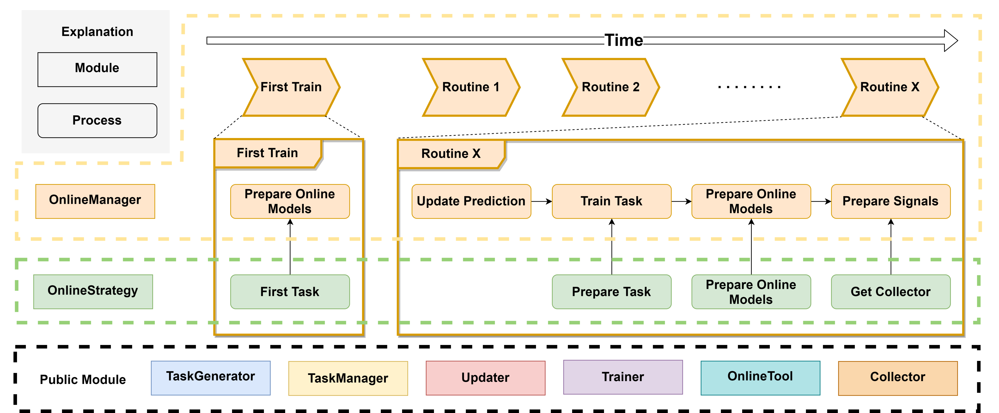

.. _online_serving:

==============
在线推理（Online Serving）
==============
.. currentmodule:: qlib

简介
====

除了回测之外，检验模型有效性的一种方法是在真实市场环境中使用最新数据进行预测，甚至基于这些预测执行真实交易。
``在线推理（Online Serving）`` 是一组用于使用最新数据的在线模型模块，包含 `在线管理（Online Manager） <#Online Manager>`_、`在线策略（Online Strategy） <#Online Strategy>`_、`在线工具（Online Tool） <#Online Tool>`_ 与 `更新器（Updater） <#Updater>`_。

`此处 <https://github.com/microsoft/qlib/tree/main/examples/online_srv>`_ 提供若干示例以供参考，展示了 ``在线推理`` 的不同功能。如果你需要管理大量模型或任务（`task`），请考虑使用 `任务管理（Task Management） <../advanced/task_management.html>`_。
这些 `示例 <https://github.com/microsoft/qlib/tree/main/examples/online_srv>`_ 基于 `任务管理 <../advanced/task_management.html>`_ 中的一些组件（例如 ``TrainerRM`` 或 ``Collector``）。

**注意**：用户应保持其数据源的及时更新以支持在线推理。例如，Qlib 提供了一组脚本 `（见此处） <https://github.com/microsoft/qlib/blob/main/scripts/data_collector/yahoo/README.md#automatic-update-of-daily-frequency-datafrom-yahoo-finance>`_，用于帮助用户自动更新 Yahoo 的日频数据。

当前已知限制
- 当前仅支持基于日频数据对下一个交易日进行更新与预测。但由于 `公开数据的限制 <https://github.com/microsoft/qlib/issues/215#issuecomment-766293563>`_，暂不支持自动生成针对下一个交易日的委托订单。

在线管理（Online Manager）
=========================

.. automodule:: qlib.workflow.online.manager
    :members:
    :noindex:

在线策略（Online Strategy）
==========================

.. automodule:: qlib.workflow.online.strategy
    :members:
    :noindex:

在线工具（Online Tool）
======================

.. automodule:: qlib.workflow.online.utils
    :members:
    :noindex:

更新器（Updater）
=================

.. automodule:: qlib.workflow.online.update
    :members:
    :noindex:
