# 分析：评估与结果分析

## 简介

`Analysis` 用于展示与“日内交易”相关的图形化报告，帮助用户以可视化方式评估和分析投资组合。常见的图形包括：

- analysis_position
  - report_graph
  - score_ic_graph
  - cumulative_return_graph
  - risk_analysis_graph
  - rank_label_graph

- analysis_model
  - model_performance_graph

注意：Qlib 中所有累计收益类指标（例如累计收益、最大回撤）均通过加法累积计算，以避免指标或图表随时间呈指数偏斜。

## 图形化报告

用户可运行以下代码查看支持的全部报告：

```python
import qlib.contrib.report as qcr
print(qcr.GRAPH_NAME_LIST)
# ['analysis_position.report_graph', 'analysis_position.score_ic_graph', 'analysis_position.cumulative_return_graph',
#  'analysis_position.risk_analysis_graph', 'analysis_position.rank_label_graph', 'analysis_model.model_performance_graph']
```

更多细节可通过类似 `help(qcr.analysis_position.report_graph)` 的方式查看函数文档。

## 使用与示例

### `analysis_position.report` 的用法

API：

- 参见模块：`qlib.contrib.report.analysis_position.report`

图形说明：

- X 轴：交易日
- Y 轴：
  - `cum bench`：基准的累计收益序列
  - `cum return wo cost`：组合（不计交易成本）的累计收益序列
  - `cum return w cost`：组合（计入交易成本）的累计收益序列
  - `return wo mdd`：不计成本的累计收益对应的最大回撤序列
  - `return w cost mdd`：计成本的累计收益对应的最大回撤序列
  - `cum ex return wo cost`：组合相对基准的累计超额收益（CAR，不计成本）
  - `cum ex return w cost`：组合相对基准的累计超额收益（计成本）
  - `turnover`：换手率序列
  - `cum ex return wo cost mdd`：不计成本的 CAR 的回撤序列
  - `cum ex return w cost mdd`：计成本的 CAR 的回撤序列
- 图中上方阴影部分：对应 `cum return wo cost` 的最大回撤区域
- 图中下方阴影部分：对应 `cum ex return wo cost` 的最大回撤区域

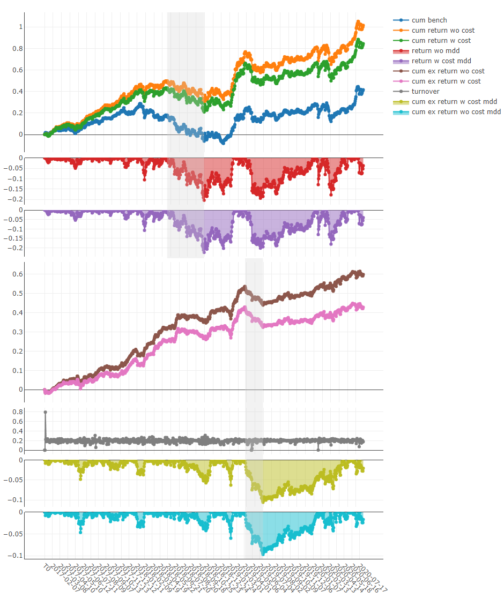

### `analysis_position.score_ic` 的用法

API：

- 参见模块：`qlib.contrib.report.analysis_position.score_ic`

图形说明：

- X 轴：交易日
- Y 轴：
  - `ic`：`label` 与 `prediction score` 的 Pearson 相关系数序列（信息系数，IC）。例中 `label` 定义为 `Ref($close, -2)/Ref($close, -1)-1`，更多详情见“数据特征”文档。
  - `rank_ic`：`label` 与 `prediction score` 的 Spearman 秩相关系数序列（Rank IC）。

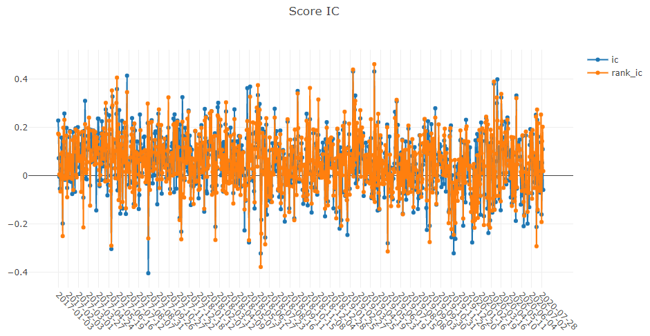

### `analysis_position.cumulative_return` 的用法

API：

- 参见模块：`qlib.contrib.report.analysis_position.cumulative_return`

图形说明（要点）：

- X 轴：交易日
- Y 轴上方：累计收益计算公式为 `(((Ref($close, -1)/$close - 1) * weight).sum() / weight.sum()).cumsum()`
- Y 轴下方：每日权重和
- 在 **sell** 图中，`y < 0` 表示获利；其他情况下 `y > 0` 表示获利。
- 在 **buy_minus_sell** 图中，下方权重图的 **y** 值为 `buy_weight + sell_weight`。
- 每幅图右侧直方图的红线表示平均值。

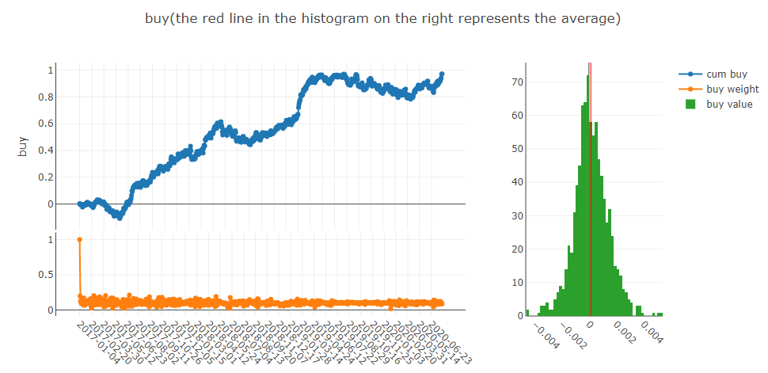

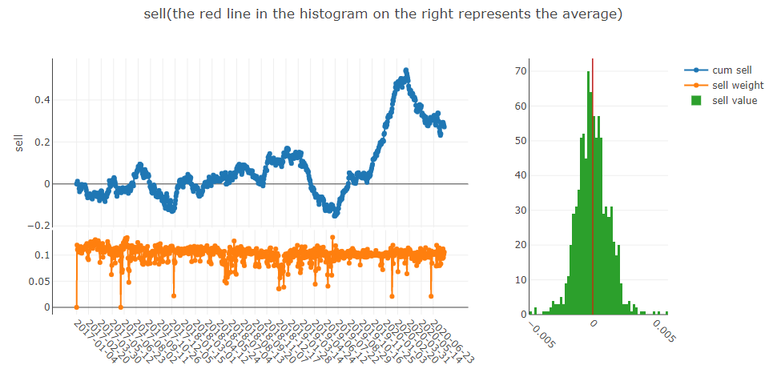

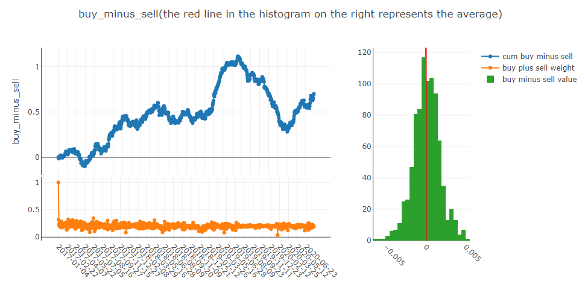

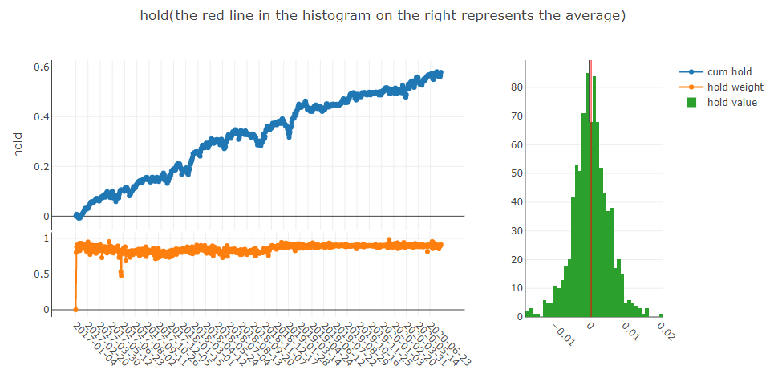

### `analysis_position.risk_analysis` 的用法

API：

- 参见模块：`qlib.contrib.report.analysis_position.risk_analysis`

图形说明：

- 常用统计图：
  - `std`
    - `excess_return_without_cost`：不计成本的 CAR 的标准差
    - `excess_return_with_cost`：计成本的 CAR 的标准差
  - `annualized_return`
    - `excess_return_without_cost`：不计成本的 CAR 的年化收益率
    - `excess_return_with_cost`：计成本的 CAR 的年化收益率
  - `information_ratio`
    - `excess_return_without_cost`：不计成本的信息比
    - `excess_return_with_cost`：计成本的信息比
    - 详情见 Information Ratio – IR: https://www.investopedia.com/terms/i/informationratio.asp
  - `max_drawdown`
    - `excess_return_without_cost`：不计成本的 CAR 的最大回撤
    - `excess_return_with_cost`：计成本的 CAR 的最大回撤

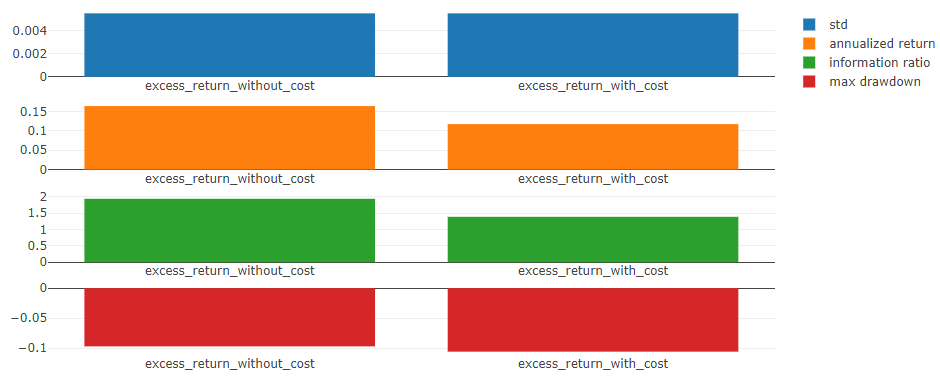

图形细节：

- 年化收益/最大回撤/信息比/标准差 图：
  - X 轴：按月分组的交易日
  - Y 轴：
    - 年化收益图：
      - `excess_return_without_cost_annualized_return`：按月 CAR（不计成本）的年化收益率序列
      - `excess_return_with_cost_annualized_return`：按月 CAR（计成本）的年化收益率序列
    - 最大回撤图：
      - `excess_return_without_cost_max_drawdown`：按月 CAR（不计成本）的最大回撤序列
      - `excess_return_with_cost_max_drawdown`：按月 CAR（计成本）的最大回撤序列
    - 信息比图：
      - `excess_return_without_cost_information_ratio`：按月 CAR（不计成本）信息比序列
      - `excess_return_with_cost_information_ratio`：按月 CAR（计成本）信息比序列
    - 标准差图：
      - `excess_return_without_cost_max_drawdown`：按月 CAR（不计成本）的标准差序列
      - `excess_return_with_cost_max_drawdown`：按月 CAR（计成本）的标准差序列

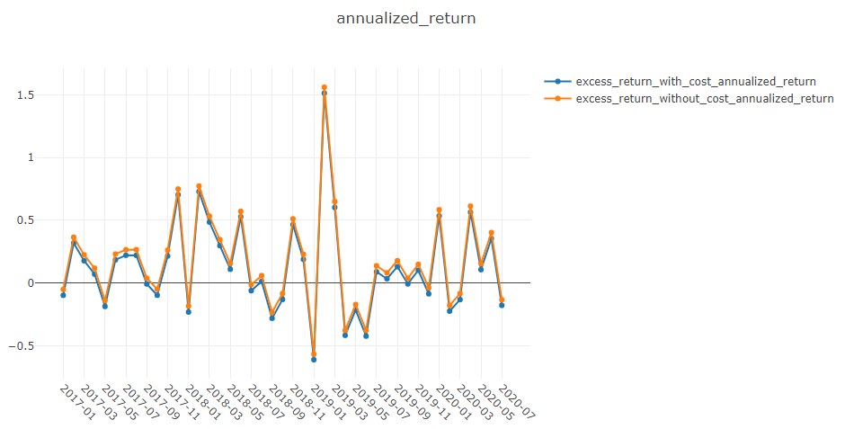

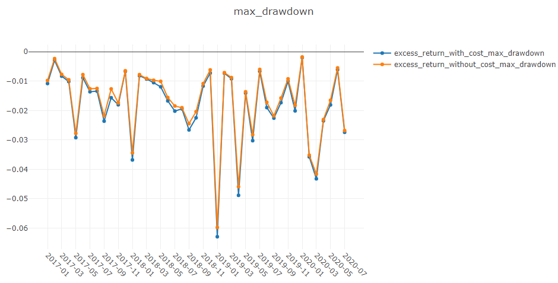

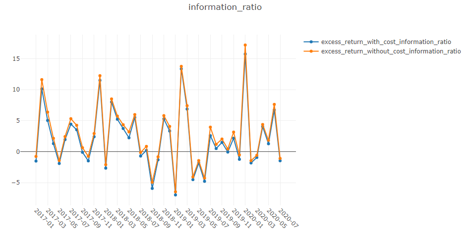

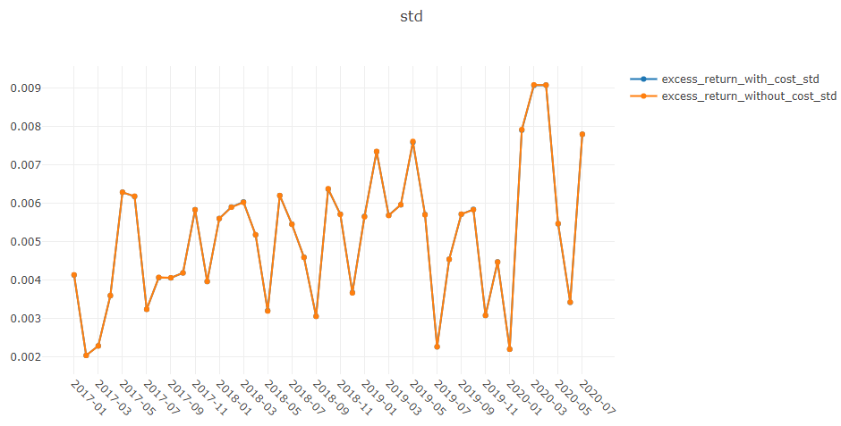

### `analysis_position.rank_label` 的用法

API：

- 参见模块：`qlib.contrib.report.analysis_position.rank_label`

图形说明：

- hold/sell/buy 图：
  - X 轴：交易日
  - Y 轴：在该交易日被持有/卖出/买入的股票的 `label` 平均排名比（ranking ratio）

其中，示例中的 `label` 定义为 `Ref($close, -1)/$close - 1`；`ranking ratio` 可表示为：

ranking ratio = (label 的升序排名) / (投资组合中股票总数)

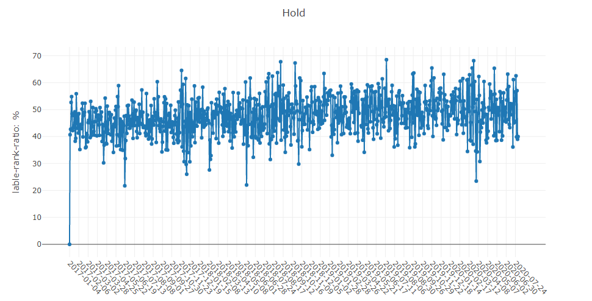

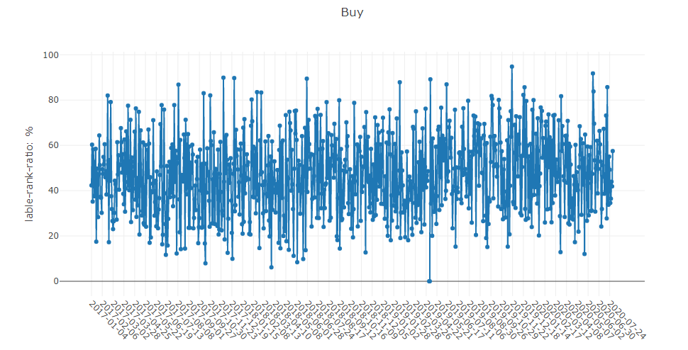

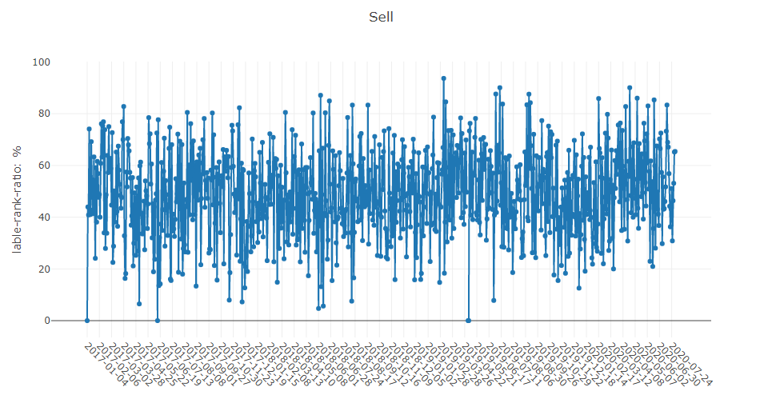

### `analysis_model.analysis_model_performance` 的用法

API：

- 参见模块：`qlib.contrib.report.analysis_model.analysis_model_performance`

图形说明要点：

- 累计收益图：将股票按 `ranking ratio` 划分为若干组（Group1..Group5），分别绘制各组的累计收益序列：
  - `Group1`：`ranking ratio <= 20%`
  - `Group2`：`20% < ranking ratio <= 40%`
  - `Group3`：`40% < ranking ratio <= 60%`
  - `Group4`：`60% < ranking ratio <= 80%`
  - `Group5`：`ranking ratio > 80%`
  - `long-short`：Group1 与 Group5 的累计收益差序列
  - `long-average`：Group1 与全部股票平均累计收益的差序列

ranking ratio 计算公式同上：

ranking ratio = (label 的升序排名) / (投资组合中股票总数)

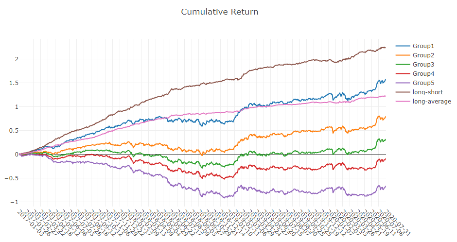

- long-short / long-average 图：展示每个交易日的 long-short 与 long-average 收益分布

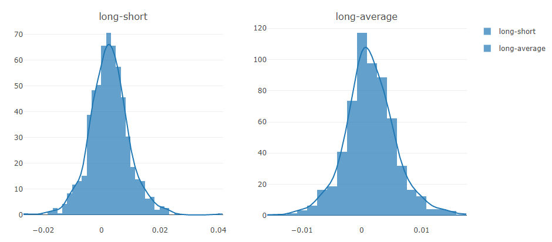

- 信息系数（IC）相关图：
  - `IC`：投资组合中 `label` 与 `prediction score` 的 Pearson 相关系数序列，可用于评估预测分数的有效性

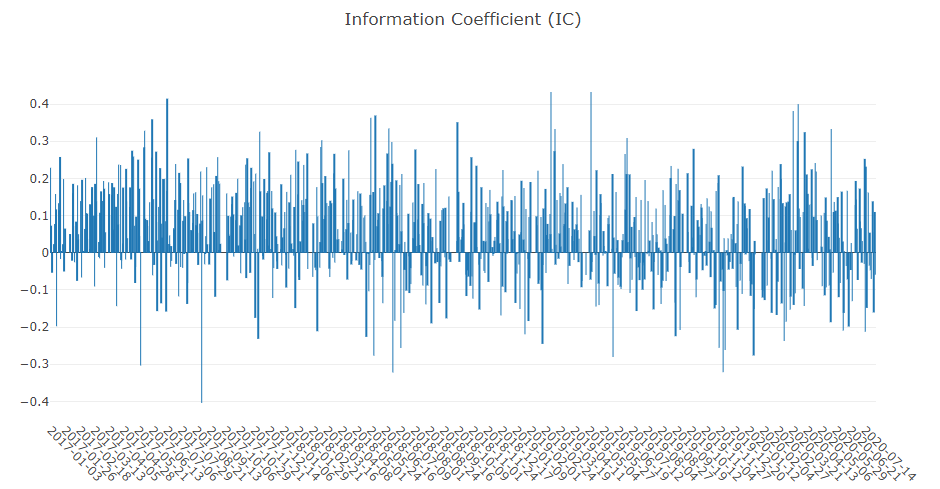

- 月度 IC：每月 IC 的平均值

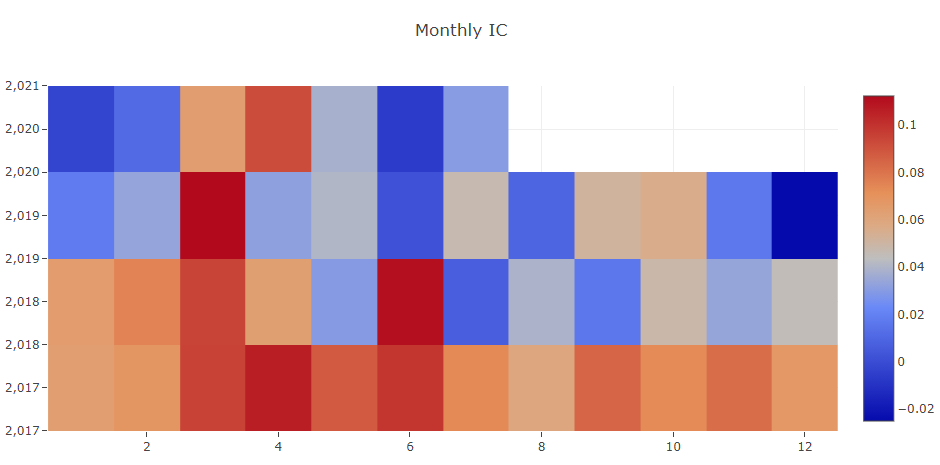

- IC 分布与 Q-Q 图：
  - `IC`：每日 IC 的分布
  - `IC Normal Dist. Q-Q`：用于检验 IC 是否服从正态分布的 Q-Q 图

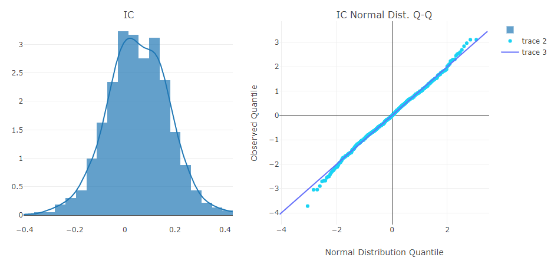

- 自相关图：
  - 显示当日预测分数与若干滞后日的预测分数之间的 Pearson 相关系数（用于估计换手率）

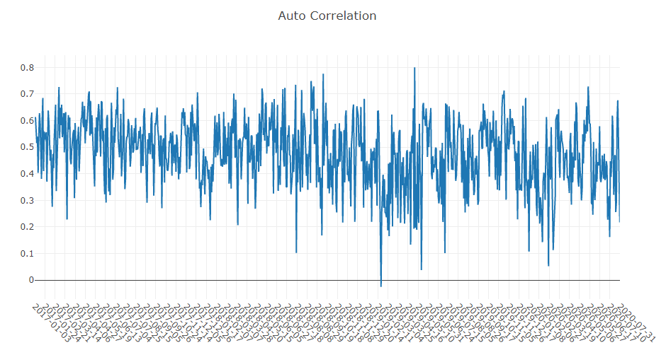

---

如需更多帮助或定制报告，建议阅读对应模块函数的文档或联系 Qlib 项目维护者。